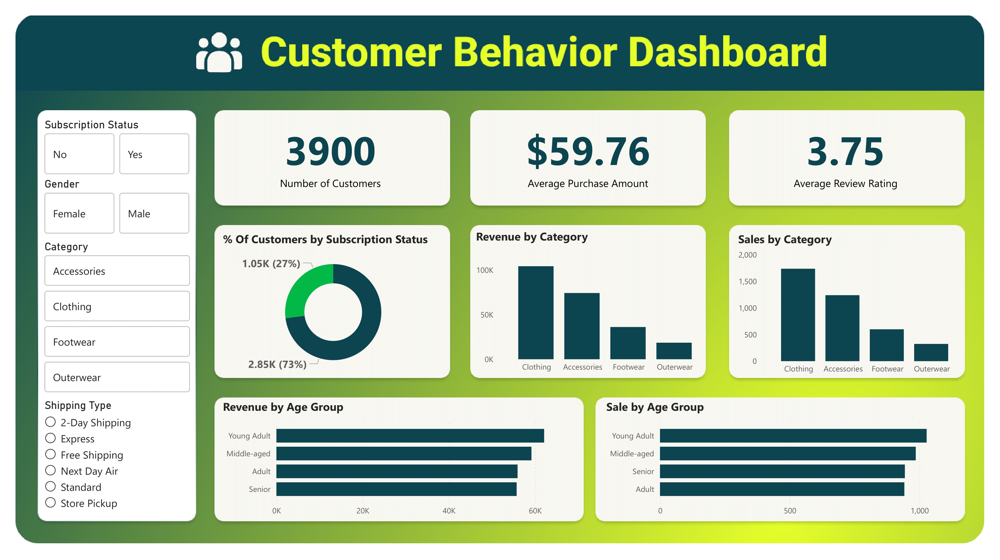

# Customer Behavior Data Analysis

## 📊 Project Overview

A comprehensive data analysis project examining customer shopping behavior patterns using SQL, Python, and Power BI. This project leverages multiple analytical tools to extract meaningful insights from customer transaction data, helping businesses understand purchasing patterns, customer preferences, and revenue trends.

## ✨ Key Features

- **SQL Data Analysis**: Complex queries to extract insights from customer shopping behavior
- **Python Data Analysis**: Statistical analysis and data exploration using Jupyter Notebooks
- **Interactive Dashboard**: Power BI visualization dashboard for real-time insights
- **Comprehensive Documentation**: Detailed project documentation and presentation materials

## 🛠️ Technologies Used

- **SQL** - Data querying and analysis
- **Python** - Data processing and statistical analysis
  - Pandas for data manipulation
  - Matplotlib/Seaborn for visualization
  - NumPy for numerical computations
- **Power BI** - Interactive dashboard and reporting
- **Jupyter Notebook** - Interactive data exploration

## 📁 Project Structure

```
customer-behavior-data-analyst-SQL-Python-PowerBI/
├── dataset/
│   ├── customer_shopping_behavior.csv          # Raw customer data
│   └── customer-behavior-data-analysis.ipynb   # Python analysis notebook
├── sql/
│   └── customer-behavior-data-analysis.sql     # SQL queries and analysis
├── powerBI/
│   └── customer_behavior_dashboard.pbix        # Power BI dashboard file
├── src/
│   └── Customer Behavior Analysis.pptx         # Presentation slides
├── Customer Behavior Analysis.pdf              # Analysis report
├── ProjectDoc.pdf                              # Project documentation
├── customer_behavior_dashboard.png             # Dashboard screenshot
└── README.md                                   # Project documentation
```

## 🔍 Analysis Components

### SQL Analysis
- Customer segmentation and profiling
- Purchase pattern identification
- Revenue analysis by product categories
- Time-based sales trends
- Customer lifetime value calculations

### Python Analysis
- Exploratory Data Analysis (EDA)
- Statistical analysis of customer behavior
- Data cleaning and preprocessing
- Correlation analysis
- Visualization of key metrics

### Power BI Dashboard
- Interactive visualizations
- Real-time KPI monitoring
- Customer demographics analysis
- Product performance metrics
- Sales trend analysis

## 📈 Key Insights

The analysis provides actionable insights into:
- Customer purchasing patterns and preferences
- High-value customer segments
- Product category performance
- Seasonal trends and patterns
- Revenue optimization opportunities

## 📊 Dashboard Preview

The Power BI dashboard includes visualizations for:
- Customer demographics breakdown
- Purchase frequency and recency analysis
- Product category performance
- Revenue trends over time
- Customer segmentation metrics

## 🖼️ Screenshots

### Power BI Dashboard


## 📄 Documentation

- **Project Documentation** ([`ProjectDoc.pdf`](ProjectDoc.pdf)) - Complete project specifications and methodology
- **Presentation** ([`Customer Behavior Analysis.pdf`](Customer%20Behavior%20Analysis.pdf)) - Presentation slides in PDF format

## 🚀 Getting Started

### Prerequisites
- Python 3.x with Jupyter Notebook
- SQL database (MySQL/PostgreSQL)
- Microsoft Power BI Desktop

### Running the Analysis

1. **SQL Analysis**
   - Import the dataset into your SQL database
   - Execute queries from `sql/customer-behavior-data-analysis.sql`

2. **Python Analysis**
   - Open `dataset/customer-behavior-data-analysis.ipynb` in Jupyter Notebook
   - Run all cells to reproduce the analysis

3. **Power BI Dashboard**
   - Open `powerBI/customer_behavior_dashboard.pbix` in Power BI Desktop
   - Refresh data connections to see updated visualizations

## 📜 License

This project is licensed under the MIT License - see the [LICENSE](LICENSE) file for details.

---

**Note**: This project demonstrates end-to-end data analysis capabilities combining SQL for data extraction, Python for statistical analysis, and Power BI for interactive visualization.
